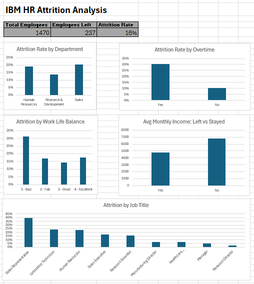

# IBM HR Attrition Analysis — Excel Dashboard

## Overview
Analysis of 1,470 IBM employees to identify the key drivers 
of employee attrition using Microsoft Excel. Built to help HR 
departments understand which employee segments are at highest 
risk of leaving and provide actionable retention recommendations.

## Tools
- Microsoft Excel (Office 365)
- Data Source: IBM HR Analytics Employee Attrition Dataset — Kaggle

## Dashboard
📊 [View Full Interactive Dashboard](https://docs.google.com/spreadsheets/d/1psLMGtgI0L18-aSAoOLr0PCWl1MVbe0U/edit?usp=sharing&ouid=107434307915434683931&rtpof=true&sd=true)

## Questions Answered
1. What is the overall attrition rate?
2. Which departments have the highest attrition?
3. Which job roles are at highest risk of leaving?
4. Does compensation differ between employees who left vs stayed?
5. Does overtime correlate with higher attrition?
6. How does work life balance affect attrition?

## Key Findings
- Overall attrition rate is 16% — 237 of 1,470 employees left.
- Employees who left earned 30% less on average ($4,787/month) 
  compared to those who stayed ($6,833/month), suggesting 
  compensation is a primary attrition driver.
- Employees working overtime are 3x more likely to leave (31% 
  attrition rate vs 10% for non-overtime employees).
- Sales Representatives have the highest attrition rate at 40% — 
  the highest of any job role in the company.
- Employees rating work life balance as "Bad" show 31% attrition, 
  more than double those rating it "Good" at 14%.

## Recommendations
1. Review compensation bands for Sales Representatives and 
   Laboratory Technicians — both show high attrition and 
   likely below-market salaries.
2. Audit overtime policies — employees working overtime are 
   3x more likely to leave.
3. Implement targeted retention bonuses for Sales staff 
   given the 40% attrition rate in that role.

## Excel Skills Demonstrated
- COUNTIF and COUNTIFS for conditional counting
- AVERAGEIF for conditional averages
- Dynamic tables with UNIQUE function
- Dashboard design with multiple chart types
- Conditional formatting heat maps
- Data cleaning and formatting
