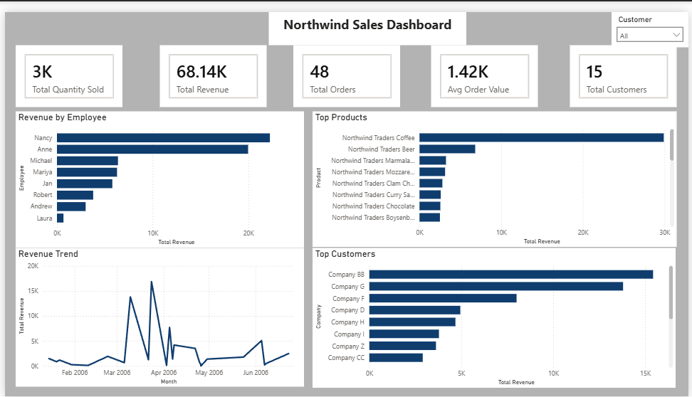

# Northwind Sales Dashboard — Power BI

## Overview
Interactive Power BI dashboard analyzing Northwind sales performance 
across employees, products, customers, and revenue trends. Built to 
give sales managers a single view of business performance with 
interactive filtering by customer.

## Tools
- Power BI Desktop
- DAX (Data Analysis Expressions)
- MySQL (data source)
- Data Source: Northwind Database

## Dashboard
📊 [Download Interactive Dashboard](https://github.com/pruiz2/data-analytics-portfolio/raw/main/northwind-powerbi-dashboard/northwind_dashboard.pbix)
*Requires Power BI Desktop to open*

## Features
- Interactive Customer slicer that filters all visuals simultaneously
- 5 KPI cards showing headline business metrics
- 4 charts covering employee, product, customer, and trend analysis
- DAX measures for Total Revenue, Avg Order Value, and rankings

## DAX Measures Built
- `Total Revenue = SUMX(order_details, unit_price * quantity)`
- `Total Orders = COUNTROWS(orders)`
- `Total Customers = DISTINCTCOUNT(orders[customer_id])`
- `Avg Order Value = DIVIDE([Total Revenue], [Total Orders])`
- `Total Quantity Sold = SUM(order_details[quantity])`
- `Employee Revenue Rank = RANKX(ALL(employees), [Total Revenue])`
- `% of Total Revenue = DIVIDE([Total Revenue], CALCULATE([Total Revenue], ALL(orders)))`

## Key Insights
- Total revenue of $68,140 across 48 orders and 15 customers.
- Nancy and Anne account for 62% of total revenue combined, 
  representing a significant employee concentration risk.
- Northwind Traders Coffee is the top product at $29,900, 
  accounting for 44% of total product revenue.
- Company BB is the top customer generating $15,000+ in revenue,
  nearly double the second ranked customer.
- Revenue peaked in April 2006 before declining through summer,
  suggesting seasonal demand patterns.

## Data Model
5 related tables connected in Power BI:
orders → order_details → products → suppliers
orders → customers
orders → employees
