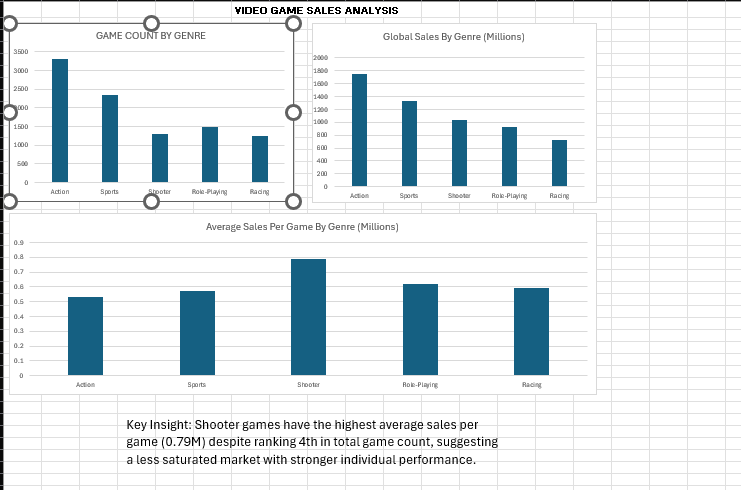

# Video Game Sales Analysis — Excel Dashboard

## Overview
Analysis of 16,000+ video games across platforms, genres, and publishers 
using Microsoft Excel. Built to identify market trends, genre performance, 
and sales efficiency across the gaming industry.

## Tools
- Microsoft Excel (Office 365)
- Data Source: Video Game Sales Dataset — Kaggle (Gregory Smith)

## Dashboard
📊 [View Full Interactive Dashboard](https://docs.google.com/spreadsheets/d/1M6IzoumEVruXlQ3t3rDttqRfAL6RXTtU/edit?usp=sharing&ouid=107434307915434683931&rtpof=true&sd=true)

## Questions Answered
1. Which genres have the most games published?
2. Which genres generate the most total global sales?
3. Which genres have the highest average sales per game?

## Key Insights
- Shooter games have the highest average sales per game (0.79M) despite 
  ranking 4th in total game count, suggesting a less saturated market 
  with stronger individual title performance.
- Action is the most published genre (3,316 games) but has the lowest 
  average sales per game (0.53M), indicating a highly saturated market.
- Less than 1% of all games released crossed the 10M sales blockbuster 
  threshold, highlighting how rare true commercial success is in gaming.
- Sports ranks 2nd in total sales (1,330M) but middle of the pack in 
  average sales, driven by consistent annual franchise releases.

## Excel Skills Demonstrated
- VLOOKUP and XLOOKUP for data retrieval
- COUNTIF, SUMIF, AVERAGEIF for conditional aggregation
- Nested IF statements for data categorization
- Pivot Tables with calculated fields
- Conditional formatting heat maps
- Dashboard design with multiple chart types
